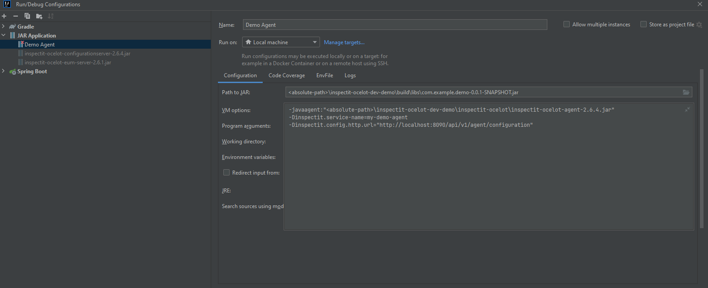
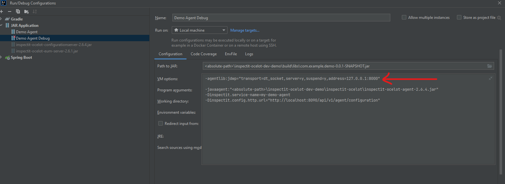
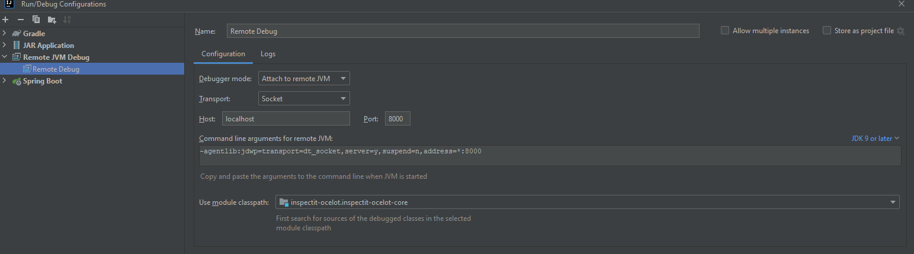

# Manual to debug the inspectit-ocelot agent (with IntelliJ)

You can create a Run/Debug Configuration in IntelliJ in the upper right corner.

Use this configuration to just run the demo application with an inspectit attached:

---

To debug an inspectit agent, you have to download the [inspectit-ocelot repository](https://github.com/inspectIT/inspectit-ocelot).

Adjust your demo run configuration like this:

Additionally, you have to configure a Remote JVM Debug in your local inspectit-ocelot repository:

---

At last, start your demo configuration (in normal mode, not debug) and after that start the Remote JVM Debug in debug mode.
